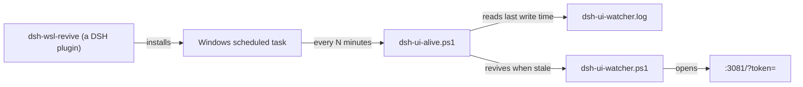

# dsh-wsl-revive

> **Install set:** part of [dsh-wsl-kit](https://github.com/173787247/dsh-wsl-kit).

DeepSeek Harness plugin: report whether the **dsh web resident** is still alive in WSL, and install a
**process-external guard** that revives it when it is not.

[中文说明 → README.zh.md](./README.zh.md)

## Where it sits



## Why the guard is not a plugin

A plugin runs **inside** the dsh process. When dsh dies the plugin dies with it, so a plugin cannot
restart the thing it lives in. The guard therefore runs from a **Windows scheduled task**: it belongs
to DSH in the sense that this plugin installs and manages it, but it survives dsh.

This is the same split the kit already uses for its other Windows-side residents.

## What it judges, and why not the process list

The resident writes one heartbeat line per minute to `dsh-ui-watcher.log`:

```
2026-01-01 00:00:00  alive; last=http://127.0.0.1:3081/?token=…
```

**The last write time of that file is the only reliable liveness signal.** Matching a process by its
command-line string finds the process doing the asking, which has produced a false "it is alive" more
than once. `wsl_revive` reports on the log's age and nothing else.

## The failure this plugin exists for

`dsh-ui-watcher.ps1` started with `-WindowStyle Hidden` dies silently within a minute — it writes its
three startup lines and then never a heartbeat. Started in the foreground, or minimised, it stays up
and has been observed catching a real dsh restart (`restart detected -> …` / `opened ok`).

So the guard always revives the resident **without `-WindowStyle Hidden`**, using a minimised window.
A unit test pins that: the generated script must not contain `-WindowStyle Hidden` next to
`Start-Process`.

## Tools

| action | effect |
|---|---|
| `status` | reports the resident's verdict and whether the guard is installed. Changes nothing. |
| `install_guard` | writes the guard script and registers the scheduled task. Idempotent; no admin needed. |
| `uninstall_guard` | removes the scheduled task. Keeps the logs. |

```
wsl_revive                                   # 只报告
wsl_revive action=install_guard
wsl_revive action=install_guard intervalMinutes=2 staleMinutes=3
wsl_revive action=uninstall_guard
```

## Requirements

- Windows with WSL, and DeepSeek Harness running inside it.
- `powershell.exe`, `schtasks.exe` and `wslpath` reachable (standard in WSL).
- `~/.dsh/tray/dsh-ui-watcher.ps1` present — install it with `dsh-wsl-tray`'s `install_tray`, or point
  `watcherPath` at wherever yours lives.

## Configuration

```yaml
- id: dsh-wsl-revive
  config:
    timeoutMs: 60000
    staleMinutes: 3        # 3 × the heartbeat interval; tolerates one scheduling jitter
    intervalMinutes: 5     # how often the guard itself runs
    watcherPath: ""        # default: ~/.dsh/tray/dsh-ui-watcher.ps1
    heartbeatLog: ""       # default: %USERPROFILE%\dsh-ui-watcher.log
```

## Tests

```
npm test
```

The unit tests cover the verdict logic, the scheduled-task arguments and the generated script, and
run anywhere. Nothing in them touches Windows.

## License

MIT
