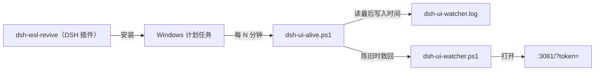

# dsh-wsl-revive

> **安装集:** 属于 [dsh-wsl-kit](https://github.com/173787247/dsh-wsl-kit)。

DeepSeek Harness 插件：报告 WSL 里 dsh web 的 **Windows 侧常驻者**还活着没有，并可安装一个
**进程外的守护**，让它在没人看着的时候自己活回来。

[English → README.md](./README.md)

## 它站在哪一层



## 为什么守护不能是插件

插件跑在 dsh 进程**里面**。dsh 死了插件跟着死，所以插件救不了它自己所在的那个东西。
守护因此由 **Windows 计划任务**拉起：它属于 DSH（这个插件负责装和管理它），但不和 DSH 同生共死。

—— 和这个套件里其他 Windows 侧常驻者用的是同一个分法。

## 判据是什么，为什么不用进程列表

常驻者每分钟往 `dsh-ui-watcher.log` 写一行心跳：

```
2026-01-01 00:00:00  alive; last=http://127.0.0.1:3081/?token=…
```

**这个文件的最后写入时间是唯一可靠的存活信号。** 用命令行字符串去匹配进程，会匹配到正在查询的
那个进程，这个办法给出过不止一次错误的「它还活着」。`wsl_revive` 只看日志有多旧。

## 这个插件要解决的那个故障

`dsh-ui-watcher.ps1` 以 `-WindowStyle Hidden` 启动时会在**一分钟内静默死掉** —— 它写出三行启动
记录，然后再也没有心跳。前台跑、或最小化跑，它能一直活着，并且实测接住过一次真实的 dsh 重启
（`restart detected -> …` 和 `opened ok`）。

所以守护救它回来时**一律不带 `-WindowStyle Hidden`**，用最小化窗口。有一条单元测试钉住这件事：
生成的脚本里，`Start-Process` 旁边不许出现 `-WindowStyle Hidden`。

## 工具

| action | 作用 |
|---|---|
| `status` | 报告常驻者的判决与守护装没装。不改任何东西。 |
| `install_guard` | 写守护脚本并注册计划任务。幂等，不需要管理员。 |
| `uninstall_guard` | 删除计划任务。保留日志。 |

```
wsl_revive                                   # 只报告
wsl_revive action=install_guard
wsl_revive action=install_guard intervalMinutes=2 staleMinutes=3
wsl_revive action=uninstall_guard
```

## 要求

- Windows + WSL，且 DeepSeek Harness 跑在 WSL 里。
- `powershell.exe`、`schtasks.exe`、`wslpath` 可达（WSL 默认就有）。
- `~/.dsh/tray/dsh-ui-watcher.ps1` 存在 —— 用 `dsh-wsl-tray` 的 `install_tray` 装它，
  或者把 `watcherPath` 指向你自己的位置。

## 配置

```yaml
- id: dsh-wsl-revive
  config:
    timeoutMs: 60000
    staleMinutes: 3        # 心跳间隔的三倍，容忍一次调度抖动
    intervalMinutes: 5     # 守护自身多久跑一次
    watcherPath: ""        # 默认 ~/.dsh/tray/dsh-ui-watcher.ps1
    heartbeatLog: ""       # 默认 %USERPROFILE%\dsh-ui-watcher.log
```

## 测试

```
npm test
```

单元测试覆盖判决逻辑、计划任务参数、以及生成的脚本，任何平台都能跑 —— 它们不碰 Windows。

## License

MIT
